# Luiz Matos

Desenvolvedor full stack sênior, com foco em arquitetura de software.

Trabalho com Java e Spring no back-end e Angular ou React no front-end. Tenho experiência no setor bancário e financeiro e uso IA generativa no meu fluxo de trabalho.

## Stack

- **Back-end:** Java, Spring Boot, Node.js, NestJS
- **Front-end:** Angular, React, TypeScript
- **Dados:** Oracle, PostgreSQL, Elasticsearch

<!-- Projetos em destaque: entra quando todos os projetos estiverem publicados -->

## Contato

- [LinkedIn](https://www.linkedin.com/in/luizeduardomatos/)
- [luiz.matos.dev@gmail.com](mailto:luiz.matos.dev@gmail.com)
